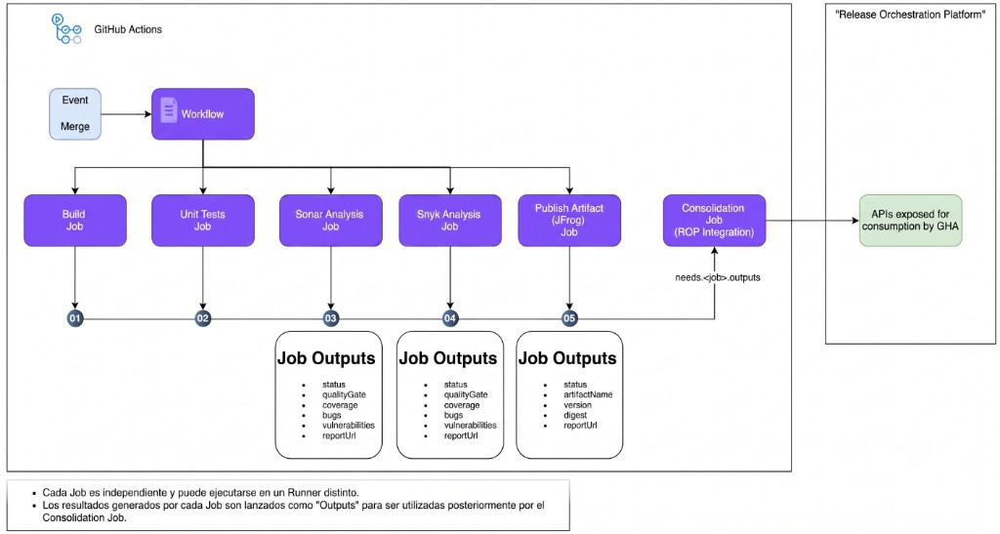

# PopShop

App **Hello World** en Spring Boot, parte de la comunidad **de3skool** (@jemjaf),
hermana de las otras apps `popshop` del curso (por ejemplo la versión desacoplada
en Kubernetes con React + FastAPI + PostgreSQL, o la versión estática en Astro).

A diferencia de esas, esta versión existe con un propósito distinto: **servir de
base para practicar un pipeline de CI/CD con GitHub Actions**. Por eso se mantiene
intencionalmente simple por dentro (sin base de datos, sin lógica de negocio real),
pero preparada por fuera (endpoints, logs, metadatos de build) para que un pipeline
externo tenga información con la que trabajar.

---

## Stack

| Componente | Versión |
|---|---|
| Java | 25 (última LTS) |
| Spring Boot | 4.1.0 (última estable) |
| Gestor de build | Maven |
| Contenedor | Docker (multi-stage, usuario no root) |

---

## Estructura del proyecto

```
popshop/
├── pom.xml
├── Dockerfile                   # build multi-stage (Maven -> JRE), usuario no root
├── .dockerignore
├── docs/
│   └── pipeline-gha.png        # diagrama del pipeline objetivo (ver más abajo)
└── src/
    ├── main/
    │   ├── java/com/de3skool/popshop/
    │   │   ├── PopshopApplication.java   # arranque + log de "app lista"
    │   │   └── HelloController.java      # endpoints Hello World
    │   └── resources/
    │       └── application.yml           # config + Actuator + metadatos de la app
    └── test/
        └── java/com/de3skool/popshop/
            ├── PopshopApplicationTests.java   # smoke test (contexto arranca)
            └── HelloControllerTest.java       # tests de los endpoints
```

---

## Ejecución local

```bash
mvn spring-boot:run
```

```bash
mvn test
```

La app queda escuchando en el puerto `8080`.

---

## Docker

```bash
docker build -t popshop:0.1.0 .
docker run -d --name popshop -p 8080:8080 popshop:0.1.0
```

| Detalle | Valor |
|---|---|
| Build | Multi-stage: `maven:3.9.16-eclipse-temurin-25-alpine` (compila) → `eclipse-temurin:25-jre-alpine` (runtime, solo JRE) |
| Usuario | No root: `popshop` (uid/gid `1000`) |
| Healthcheck | `curl` contra `/actuator/health` cada 30s |
| Puerto | `8080` |

Las versiones de las imágenes base están fijadas de forma explícita (no se usa
la etiqueta `latest`), tanto para Maven+JDK en el build como para el JRE en el
runtime, siguiendo el mismo criterio que las imágenes de los otros `popshop`
de la comunidad.

---

## Endpoints disponibles hoy

| Método | Ruta | Descripción |
|---|---|---|
| GET | `/` | Info básica de la app (nombre, versión, endpoints disponibles) |
| GET | `/api/hello` | Endpoint Hello World (`"Hola Mundo desde PopShop"`) |
| GET | `/actuator/health` | Salud de la app (Spring Boot Actuator) |
| GET | `/actuator/info` | Metadatos de la app (nombre, versión, descripción) |
| GET | `/actuator/metrics` | Métricas de la app (Spring Boot Actuator) |

Estos endpoints y los mensajes de log que emiten (`PopshopApplication`,
`HelloController`) están puestos a propósito: son el tipo de información
(estado, versión, confirmación de arranque) que luego un pipeline de CI/CD
suele necesitar leer para construir sus propios *outputs*.

---

## Diagrama objetivo del pipeline (GitHub Actions)

Este es el pipeline que se busca practicar sobre esta app. **No está implementado
todavía**: la app de momento solo expone lo necesario (endpoints, logs, versión)
para que, cuando se construya, tenga información real con la que trabajar.



### Glosario del diagrama

| Elemento | Qué significa |
|---|---|
| **Event Merge** | El disparador (`trigger`) del workflow: se activa cuando ocurre un merge de código hacia una rama del repositorio. |
| **Workflow** | El archivo de definición del pipeline en GitHub Actions; agrupa y coordina todos los *jobs* que se ejecutan a partir del evento. |
| **Build Job (01)** | Job encargado de compilar el proyecto y generar el artefacto (el `.jar`). |
| **Unit Tests Job (02)** | Job encargado de ejecutar las pruebas unitarias del proyecto. |
| **Sonar Analysis Job (03)** | Job de análisis estático de calidad de código (tipo SonarQube/SonarCloud): calcula el *quality gate*, cobertura, bugs, vulnerabilidades de código, etc. |
| **Snyk Analysis Job (04)** | Job de análisis de seguridad de dependencias (tipo Snyk): detecta vulnerabilidades conocidas en las librerías que usa el proyecto. |
| **Publish Artifact (JFrog) Job (05)** | Job encargado de publicar el artefacto generado en un repositorio de artefactos (tipo JFrog Artifactory). |
| **Job Outputs** | Los datos que cada job expone como salida (`outputs`) para que otros jobs los puedan leer después. En el diagrama hay tres bloques de *outputs*: uno con datos de calidad (`status`, `qualityGate`, `coverage`, `bugs`, `vulnerabilities`, `reportUrl`) para el job de Sonar, otro con la misma forma para el job de Snyk, y otro con datos de artefacto (`status`, `artifactName`, `version`, `digest`, `reportUrl`) para el job de publicación. |
| **`needs.<job>.outputs`** | La sintaxis de GitHub Actions que usa un job para leer los *outputs* que otro job (declarado en su `needs`) publicó previamente. |
| **Consolidation Job (ROP Integration)** | Job final que depende de (`needs`) todos los jobs anteriores, reúne sus *outputs* y produce un resultado único y consolidado. |
| **Release Orchestration Platform** | La plataforma externa (fuera de GitHub Actions) que recibe el resultado consolidado, a través de una API expuesta para ese fin. |
| **"Cada Job es independiente y puede ejecutarse en un Runner distinto"** | Cada job del workflow corre de forma aislada, potencialmente en una máquina/contenedor (*runner*) diferente al de los demás jobs. |
| **"Los resultados generados por cada Job son lanzados como Outputs..."** | Refuerza que la única forma en que un job comparte información con otro (incluido el Consolidation Job) es a través de sus *outputs* declarados. |

---

## Notas de diseño

- **Simplicidad interna a propósito**: no hay capa de datos ni reglas de negocio;
  el objetivo de esta app es el pipeline, no el dominio.
- **Starters modulares de Spring Boot 4**: se usa `spring-boot-starter-webmvc`
  (el nuevo nombre de `spring-boot-starter-web`, renombrado en Spring Boot 4) y
  `spring-boot-starter-webmvc-test` para los tests.
- **Spring Boot Actuator** ya está habilitado (`/actuator/health`, `/actuator/info`,
  `/actuator/metrics`) porque son el tipo de endpoint que un job de Build o de
  Consolidation típicamente necesita consultar.
- **`app.version`** viene del `<version>` del `pom.xml` (inyectado por filtrado de
  recursos de Maven) y se expone en `/`, `/api/hello` y `/actuator/info`, para que
  un futuro job de publicación de artefactos tenga de dónde leer la versión.
- **`spring-boot-maven-plugin` con `build-info`** genera metadatos de build
  (`build-info.properties`) que Actuator expone en `/actuator/info`.
- **JaCoCo** ya está configurado en el `pom.xml` (genera
  `target/site/jacoco/jacoco.xml` al correr `mvn test`), que es el insumo típico
  que un job de análisis de calidad (Sonar) necesita para calcular cobertura.
- **Logs en `INFO`** en el arranque y en cada endpoint (`PopshopApplication`,
  `HelloController`), pensados para poder confirmarlos desde los logs de un job
  de GitHub Actions.
- **Docker multi-stage**: la etapa de build (Maven + JDK) nunca llega a la
  imagen final; el runtime solo lleva el JRE y el jar, lo que reduce superficie
  y tamaño de imagen.
- **Usuario no root en el contenedor** (`popshop`, uid/gid `1000`) y
  `HEALTHCHECK` reutilizando `/actuator/health`, para que un futuro job de
  publicación de artefactos (JFrog) o de despliegue tenga una señal de salud
  ya lista.
